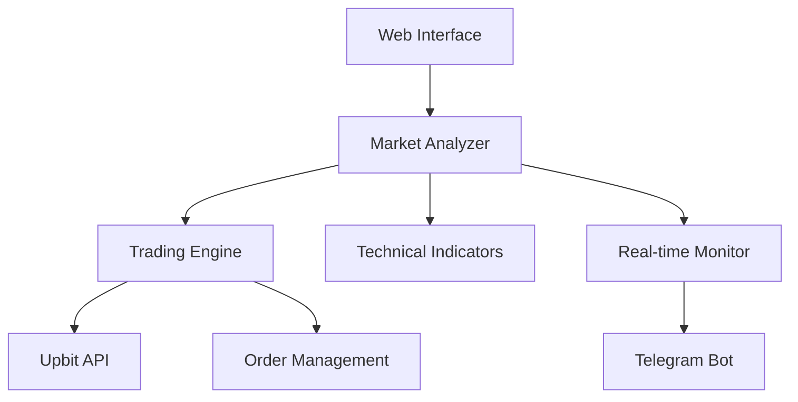

# HYUNSANG's Coin Bot 개발 가이드

## 1. 개요 (Overview)
- 프로젝트명: HYUNSANG's Coin Bot
- 버전: 1.0.0
- 설명: 업비트 API를 활용한 비트코인 자동매매 프로그램
- 목적: 기술적 분석과 실시간 시장 모니터링을 통한 자동화된 암호화폐 거래 시스템 구축

## 2. 범위 및 목적 (Scope & Purpose)

### 2.1 문서의 목적
- Cursor와의 효율적인 협업을 위한 개발 가이드라인 제공
- 프롬프트 입력 시 Cursor의 개발 방향 및 기준 제시
- 변수 및 함수의 중복 방지와 일관성 유지
- 보안 정보 관리 (API Key 등 민감 정보)

### 2.2 주요 기능 범위
- 실시간 시장 데이터 수집 및 분석
- 기술적 지표 기반 매매 신호 생성
- 자동 매매 실행
- 실시간 모니터링 및 알림
- 설정 관리 및 백테스팅

## 3. 주요 로직

### 3.1 설정 관리

#### 3.1.0 설정 구조
```python
# 웹 인터페이스 설정 (사용자 설정 가능)
WEB_SETTINGS = {
    # 투자 설정
    'investment': {
        'amount_per_trade': {
            'value': float,           # 종목당 투자금액 (KRW)
            'min': 5000.0,           # 최소값 (업비트 최소 주문금액)
            'max': 1000000.0,        # 최대값
            'step': 1000.0,          # 조정 단위
            'default': 100000.0      # 기본값
        },
        'max_coins': {
            'value': int,            # 최대 보유 코인 수
            'min': 1,
            'max': 10,
            'step': 1,
            'default': 5
        },
        'use_percentage': {
            'value': bool,           # 퍼센트 기반 투자 여부
            'default': False
        },
        'investment_percentage': {
            'value': float,          # 자산 대비 투자 비율 (%)
            'min': 1.0,
            'max': 100.0,
            'step': 1.0,
            'default': 10.0
        }
    },

    # 매수 조건 설정
    'buy_conditions': {
        'trend_filter': {
            'value': bool,           # 15분봉 추세 필터 사용
            'default': True
        },
        'rsi': {
            'enabled': {
                'value': bool,
                'default': True
            },
            'period': {
                'value': int,
                'min': 5,
                'max': 30,
                'step': 1,
                'default': 14
            },
            'oversold': {
                'value': float,
                'min': 20.0,
                'max': 40.0,
                'step': 1.0,
                'default': 30.0
            }
        },
        'volume': {
            'enabled': {
                'value': bool,
                'default': True
            },
            'surge_ratio': {
                'value': float,
                'min': 1.5,
                'max': 10.0,
                'step': 0.1,
                'default': 3.0
            }
        },
        'macd': {
            'enabled': {
                'value': bool,
                'default': True
            },
            'fast_period': {
                'value': int,
                'min': 8,
                'max': 16,
                'step': 1,
                'default': 12
            },
            'slow_period': {
                'value': int,
                'min': 20,
                'max': 30,
                'step': 1,
                'default': 26
            },
            'signal_period': {
                'value': int,
                'min': 5,
                'max': 12,
                'step': 1,
                'default': 9
            }
        }
    },

    # 매도 조건 설정
    'sell_conditions': {
        'stop_loss': {
            'enabled': {
                'value': bool,
                'default': True
            },
            'threshold': {
                'value': float,      # 손절 기준 (%)
                'min': 1.0,
                'max': 10.0,
                'step': 0.1,
                'default': 3.0
            }
        },
        'take_profit': {
            'enabled': {
                'value': bool,
                'default': True
            },
            'threshold': {
                'value': float,      # 익절 기준 (%)
                'min': 1.0,
                'max': 20.0,
                'step': 0.1,
                'default': 5.0
            }
        },
        'trailing_stop': {
            'enabled': {
                'value': bool,
                'default': False
            },
            'activation_profit': {
                'value': float,      # 트레일링 스탑 활성화 수익률 (%)
                'min': 1.0,
                'max': 10.0,
                'step': 0.1,
                'default': 2.0
            },
            'distance': {
                'value': float,      # 트레일링 스탑 거리 (%)
                'min': 0.5,
                'max': 5.0,
                'step': 0.1,
                'default': 1.0
            }
        }
    },

    # 알림 설정
    'notifications': {
        'telegram': {
            'enabled': {
                'value': bool,
                'default': True
            },
            'chat_id': {
                'value': str,
                'default': ''
            }
        },
        'events': {
            'trade_start': {
                'value': bool,
                'default': True
            },
            'trade_complete': {
                'value': bool,
                'default': True
            },
            'profit_loss': {
                'value': bool,
                'default': True
            },
            'error': {
                'value': bool,
                'default': True
            }
        }
    }
}

# 시스템 설정 (코드에서만 설정 가능)
SYSTEM_SETTINGS = {
    # API 설정
    'api': {
        'upbit': {
            'access_key': str,       # 업비트 API 액세스 키
            'secret_key': str,       # 업비트 API 시크릿 키
            'request_limit': 30,     # 분당 요청 제한
            'request_window': 60,    # 요청 윈도우 (초)
            'retry_count': 3,        # 재시도 횟수
            'retry_delay': 1.0       # 재시도 대기 시간 (초)
        },
        'telegram': {
            'bot_token': str,        # 텔레그램 봇 토큰
            'retry_count': 3,
            'retry_delay': 1.0
        }
    },

    # 데이터베이스 설정
    'database': {
        'type': 'sqlite',           # 데이터베이스 종류
        'path': 'data/trading.db',  # 데이터베이스 경로
        'backup_interval': 86400,   # 백업 주기 (초)
        'backup_count': 7,          # 보관할 백업 수
        'tables': {
            'trades': 'trades',     # 거래 내역 테이블
            'assets': 'assets',     # 자산 내역 테이블
            'settings': 'settings'  # 설정 저장 테이블
        }
    },

    # 캐시 설정
    'cache': {
        'market_data': {
            'duration': 900,        # 캐시 유지 시간 (초)
            'max_size': 1000,       # 최대 캐시 항목 수
        },
        'order_book': {
            'duration': 60,
            'max_size': 100,
        },
        'indicators': {
            'duration': 300,
            'max_size': 500,
        }
    },

    # 로깅 설정
    'logging': {
        'level': 'INFO',           # 로그 레벨
        'format': '%(asctime)s [%(levelname)s] %(message)s',
        'file': {
            'enabled': True,
            'path': 'logs/trading.log',
            'max_size': 10485760,   # 최대 파일 크기 (10MB)
            'backup_count': 5,      # 보관할 로그 파일 수
        }
    },

    # 성능 모니터링 설정
    'monitoring': {
        'enabled': True,
        'interval': 60,            # 모니터링 주기 (초)
        'metrics': {
            'system': True,        # 시스템 메트릭 수집
            'trading': True,       # 거래 메트릭 수집
            'api': True,           # API 메트릭 수집
        }
    },

    # 백테스팅 설정
    'backtest': {
        'data_dir': 'data/historical',
        'results_dir': 'results/backtest',
        'parallel_runs': 4,        # 병렬 실행 수
        'default_commission': 0.0005  # 기본 수수료율
    }
}

# 주문 관련 설정
ORDER_SETTINGS = {
    # 주문 타입 정의
    'order_types': {
        'MARKET': 'market',        # 시장가 주문
        'LIMIT': 'limit',          # 지정가 주문
    },

    # 주문 상태
    'order_status': {
        'WAIT': 'wait',           # 체결 대기
        'DONE': 'done',           # 체결 완료
        'CANCEL': 'cancel',       # 주문 취소
    },

    # 주문 측
    'order_sides': {
        'BUY': 'bid',             # 매수
        'SELL': 'ask',            # 매도
    },

    # 주문 설정
    'settings': {
        'default_type': 'MARKET',  # 기본 주문 타입
        'slippage': 0.0002,       # 슬리피지 (0.02%)
        'min_order_amount': 5000,  # 최소 주문금액
        'max_wait_time': 30,      # 최대 대기시간 (초)
        'cancel_timeout': 10,      # 취소 타임아웃 (초)
    },

    # 주문 유효성 검사
    'validation': {
        'price_decimal_places': 4,  # 가격 소수점
        'quantity_decimal_places': 8,  # 수량 소수점
        'min_price_unit': 1,       # 최소 호가단위
    }
}

# 주문 처리 로직
ORDER_PROCESSING = {
    # 매수 주문 처리
    'buy_order': {
        # 매수 가격 결정
        'price_calculation': '''
        def calculate_buy_price(current_price, order_book):
            # 호가창 스프레드 계산
            spread = order_book['asks'][0]['price'] - order_book['bids'][0]['price']
            spread_ratio = spread / current_price
            
            # 시장가 매수 시 약간의 프리미엄 추가
            if ORDER_SETTINGS['settings']['default_type'] == 'MARKET':
                premium = current_price * ORDER_SETTINGS['settings']['slippage']
                return current_price + premium
            
            # 지정가 매수 시 호가창 기반 가격 결정
            return order_book['asks'][0]['price']
        ''',

        # 매수 수량 계산
        'quantity_calculation': '''
        def calculate_buy_quantity(available_amount, price):
            # 최소 주문금액 확인
            if available_amount < ORDER_SETTINGS['settings']['min_order_amount']:
                return 0
                
            # 수수료를 고려한 수량 계산
            fee_rate = 0.0005  # 업비트 수수료 0.05%
            quantity = (available_amount * (1 - fee_rate)) / price
            
            # 수량 소수점 처리
            decimals = ORDER_SETTINGS['validation']['quantity_decimal_places']
            return math.floor(quantity * 10**decimals) / 10**decimals
        ''',

        # 주문 실행
        'execution': '''
        def execute_buy_order(market, price, quantity):
            try:
                order = {
                    'market': market,
                    'side': ORDER_SETTINGS['order_sides']['BUY'],
                    'price': price,
                    'quantity': quantity,
                    'type': ORDER_SETTINGS['settings']['default_type']
                }
                
                # 주문 요청
                response = upbit.place_order(**order)
                
                # 주문 상태 모니터링
                start_time = time.time()
                while time.time() - start_time < ORDER_SETTINGS['settings']['max_wait_time']:
                    status = upbit.get_order(response['uuid'])
                    if status['state'] == ORDER_SETTINGS['order_status']['DONE']:
                        return status
                    time.sleep(1)
                
                # 시간 초과 시 주문 취소
                upbit.cancel_order(response['uuid'])
                return None
                
            except Exception as e:
                logger.error(f"매수 주문 실패: {str(e)}")
                return None
        '''
    },

    # 매도 주문 처리
    'sell_order': {
        # 매도 가격 결정
        'price_calculation': '''
        def calculate_sell_price(current_price, order_book):
            # 호가창 스프레드 계산
            spread = order_book['asks'][0]['price'] - order_book['bids'][0]['price']
            spread_ratio = spread / current_price
            
            # 시장가 매도 시 약간의 할인 적용
            if ORDER_SETTINGS['settings']['default_type'] == 'MARKET':
                discount = current_price * ORDER_SETTINGS['settings']['slippage']
                return current_price - discount
            
            # 지정가 매도 시 호가창 기반 가격 결정
            return order_book['bids'][0]['price']
        ''',

        # 매도 수량 계산
        'quantity_calculation': '''
        def calculate_sell_quantity(holding_quantity, partial_sell=False, partial_ratio=1.0):
            if partial_sell:
                quantity = holding_quantity * partial_ratio
            else:
                quantity = holding_quantity
            
            # 수량 소수점 처리
            decimals = ORDER_SETTINGS['validation']['quantity_decimal_places']
            return math.floor(quantity * 10**decimals) / 10**decimals
        ''',

        # 주문 실행
        'execution': '''
        def execute_sell_order(market, price, quantity):
            try:
                order = {
                    'market': market,
                    'side': ORDER_SETTINGS['order_sides']['SELL'],
                    'price': price,
                    'quantity': quantity,
                    'type': ORDER_SETTINGS['settings']['default_type']
                }
                
                # 주문 요청
                response = upbit.place_order(**order)
                
                # 주문 상태 모니터링
                start_time = time.time()
                while time.time() - start_time < ORDER_SETTINGS['settings']['max_wait_time']:
                    status = upbit.get_order(response['uuid'])
                    if status['state'] == ORDER_SETTINGS['order_status']['DONE']:
                        return status
                    time.sleep(1)
                
                # 시간 초과 시 주문 취소
                upbit.cancel_order(response['uuid'])
                return None
                
            except Exception as e:
                logger.error(f"매도 주문 실패: {str(e)}")
                return None
        '''
    }
}
```

#### 3.1.1 기본 설정
```python
# 기본 설정 변수 정의
BASE_SETTINGS = {
    # 투자 설정
    'investment': {
        'amount_per_trade': float,    # 종목당 투자금액 (KRW)
        'max_total_amount': float,    # 최대 총 투자금액 (KRW)
        'max_coins': int,             # 최대 보유 코인 수 (1-10)
        'min_order_amount': float,    # 최소 주문금액 (KRW, 업비트 최소 5000원)
    },
    
    # 가격 필터
    'price_filter': {
        'min_price': float,           # 최소 거래가 (KRW)
        'max_price': float,           # 최대 거래가 (KRW)
        'price_unit': float,          # 호가 단위 (KRW)
    },
    
    # 거래량 필터
    'volume_filter': {
        'top_volume_count': int,      # 거래량 상위 선정 수
        'min_volume_btc': float,      # 최소 거래량 (BTC)
        'volume_ma_period': int,      # 거래량 이동평균 기간
    },
    
    # 제외 설정
    'exclusions': {
        'excluded_coins': List[str],   # 제외 코인 목록
        'excluded_markets': List[str], # 제외 마켓 목록
    },
    
    # 시간 설정
    'time_settings': {
        'trading_start': str,         # 거래 시작 시간 (HH:MM)
        'trading_end': str,           # 거래 종료 시간 (HH:MM)
        'candle_interval': str,       # 캔들 간격 ('minute1', 'minute3', 'minute5', 'minute15')
        'update_interval': int,       # 데이터 업데이트 주기 (초)
    }
}
```

#### 3.1.2 매수 설정
```python
# 매수 조건 변수 정의
BUY_CONDITIONS = {
    # 활성화 설정
    'enabled': {
        'trend_filter': bool,         # 15분봉 추세 필터
        'golden_cross': bool,         # 골든크로스
        'rsi': bool,                  # RSI
        'bollinger': bool,            # 볼린저 밴드
        'volume_surge': bool,         # 거래량 급증
        'macd': bool,                 # MACD
    },
    
    # 시장 상태별 임계값
    'thresholds': {
        'bull': {                     # 상승장 조건
            'rsi': {
                'value': float,       # RSI 기준값 (0-100)
                'period': int,        # RSI 계산 기간
                'min_slope': float,   # 최소 기울기
            },
            'bollinger': {
                'sigma': float,       # 표준편차 승수
                'period': int,        # 기간
                'position': float,    # 밴드 내 위치 (-1 to 1)
            },
            'volume': {
                'surge_ratio': float, # 거래량 급증 비율
                'ma_period': int,     # 이동평균 기간
            },
            'trend': {
                'ema_fast': int,      # 단기 EMA 기간
                'ema_slow': int,      # 장기 EMA 기간
                'min_slope': float,   # 최소 기울기
            }
        },
        'range': {...},               # 박스장 조건 (bull과 동일 구조)
        'bear': {...}                 # 하락장 조건 (bull과 동일 구조)
    },
    
    # 매수 신호 계산식
    'signal_calculations': {
        # RSI 계산
        'rsi': '''
        delta = close_prices.diff()
        gain = (delta.where(delta > 0, 0)).rolling(window=period).mean()
        loss = (-delta.where(delta < 0, 0)).rolling(window=period).mean()
        rs = gain / loss
        rsi = 100 - (100 / (1 + rs))
        ''',
        
        # 볼린저 밴드 계산
        'bollinger': '''
        ma = close_prices.rolling(window=period).mean()
        std = close_prices.rolling(window=period).std()
        upper = ma + sigma * std
        lower = ma - sigma * std
        position = (close_prices - lower) / (upper - lower)
        ''',
        
        # 거래량 급증 계산
        'volume_surge': '''
        volume_ma = volume.rolling(window=ma_period).mean()
        surge_ratio = volume / volume_ma
        is_surge = surge_ratio > threshold
        ''',
        
        # 추세 기울기 계산
        'trend_slope': '''
        ema_fast = close_prices.ewm(span=ema_fast_period).mean()
        ema_slow = close_prices.ewm(span=ema_slow_period).mean()
        slope = (ema_fast - ema_fast.shift(1)) / ema_fast.shift(1)
        '''
    }
}
```

#### 3.1.3 매도 설정
```python
# 매도 조건 변수 정의
SELL_CONDITIONS = {
    # 손절 설정
    'stop_loss': {
        'enabled': bool,
        'threshold': float,           # 손절 기준 (%)
        'trailing': {
            'enabled': bool,
            'activation': float,      # 활성화 수익률 (%)
            'distance': float,        # 추적 간격 (%)
        }
    },
    
    # 익절 설정
    'take_profit': {
        'enabled': bool,
        'threshold': float,           # 익절 기준 (%)
        'trailing': {
            'enabled': bool,
            'activation': float,      # 활성화 수익률 (%)
            'distance': float,        # 추적 간격 (%)
        },
        'partial': {
            'enabled': bool,
            'levels': List[Dict],     # 부분 익절 레벨
            # 예: [{'profit': 3.0, 'portion': 0.5}, {'profit': 5.0, 'portion': 0.3}]
        }
    },
    
    # 기술적 지표 기반 매도
    'technical': {
        'dead_cross': {
            'enabled': bool,
            'fast_period': int,       # 단기 이동평균 기간
            'slow_period': int,       # 장기 이동평균 기간
        },
        'rsi': {
            'enabled': bool,
            'period': int,            # RSI 기간
            'overbought': float,      # 과매수 기준
        },
        'bollinger': {
            'enabled': bool,
            'period': int,            # 기간
            'sigma': float,           # 표준편차 승수
            'position_threshold': float, # 상단 돌파 기준
        }
    },
    
    # 매도 신호 계산식
    'signal_calculations': {
        # 손절가 계산
        'stop_loss_price': '''
        if trailing_enabled and current_profit >= trailing_activation:
            stop_loss = max(previous_stop_loss, 
                          entry_price * (1 + current_profit - trailing_distance))
        else:
            stop_loss = entry_price * (1 - stop_loss_threshold)
        ''',
        
        # 익절가 계산
        'take_profit_price': '''
        if trailing_enabled and current_profit >= trailing_activation:
            take_profit = max(previous_take_profit,
                            entry_price * (1 + current_profit - trailing_distance))
        else:
            take_profit = entry_price * (1 + take_profit_threshold)
        ''',
        
        # 부분 익절 계산
        'partial_sell_amount': '''
        for level in sorted(profit_levels, key=lambda x: x['profit']):
            if current_profit >= level['profit']:
                sell_amount = holding_amount * level['portion']
                remaining_portion -= level['portion']
        '''
    }
}
```

#### 3.1.4 알림 설정
```python
# 알림 설정 변수 정의
NOTIFICATION_SETTINGS = {
    # 거래 알림
    'trade': {
        'start': {
            'enabled': bool,
            'template': str,          # 알림 템플릿
            'channels': List[str],    # 알림 채널 (telegram, email 등)
        },
        'complete': {
            'enabled': bool,
            'template': str,
            'channels': List[str],
            'min_amount': float,      # 최소 알림 금액
        },
        'profit_loss': {
            'enabled': bool,
            'template': str,
            'channels': List[str],
            'threshold': float,       # 손익 알림 기준 (%)
        }
    },
    
    # 시스템 알림
    'system': {
        'error': {
            'enabled': bool,
            'template': str,
            'channels': List[str],
            'levels': List[str],      # 알림 레벨 (ERROR, CRITICAL)
        },
        'daily_summary': {
            'enabled': bool,
            'template': str,
            'channels': List[str],
            'time': str,              # 발송 시간 (HH:MM)
        },
        'signal': {
            'enabled': bool,
            'template': str,
            'channels': List[str],
            'conditions': List[str],   # 알림 조건
        }
    },
    
    # 알림 템플릿
    'templates': {
        'trade_start': '''
        🔄 매매 시작
        코인: {coin_name} ({market})
        금액: {amount:,}원
        현재가: {current_price:,}원
        ''',
        
        'trade_complete': '''
        ✅ 매매 완료
        코인: {coin_name} ({market})
        유형: {trade_type}
        체결가: {executed_price:,}원
        수량: {quantity}
        총액: {total_amount:,}원
        수수료: {fee:,}원
        ''',
        
        'profit_loss': '''
        💰 손익 발생
        코인: {coin_name} ({market})
        매수가: {entry_price:,}원
        매도가: {exit_price:,}원
        수익률: {profit_rate:.2f}%
        수익금: {profit_amount:,}원
        ''',
        
        'error': '''
        ⚠️ 에러 발생
        시간: {timestamp}
        레벨: {level}
        메시지: {message}
        ''',
        
        'daily_summary': '''
        📊 일일 요약 ({date})
        총 자산: {total_asset:,}원
        보유 현금: {cash:,}원
        투자 금액: {invested:,}원
        일간 수익률: {daily_profit:.2f}%
        보유 코인: {coin_count}개
        거래 횟수: {trade_count}회
        '''
    }
}
```

### 3.2 모니터링 시스템

#### 3.2.1 봇 상태 관리
```python
# 봇 상태 변수
BOT_STATUS = {
    'state': Enum('BotState', ['RUNNING', 'STOPPED', 'PAUSED']),
    'last_update': datetime,
    'uptime': timedelta,
    'error_count': int,
    'restart_count': int,
    'performance_metrics': {
        'cpu_usage': float,           # CPU 사용률 (%)
        'memory_usage': float,        # 메모리 사용량 (MB)
        'api_latency': float,         # API 응답 시간 (ms)
        'db_connections': int,        # DB 연결 수
    }
}

# 모니터링 주기
MONITORING_INTERVALS = {
    'market_data': 10,                # 시장 데이터 갱신 (초)
    'account_info': 60,               # 계좌 정보 갱신 (초)
    'performance_metrics': 300,       # 성능 지표 갱신 (초)
    'status_check': 30,              # 상태 점검 (초)
}
```

#### 3.2.2 계좌 정보 관리
```python
# 계좌 정보 변수
ACCOUNT_INFO = {
    'balance': {
        'total_asset': float,         # 총 자산 (KRW)
        'available_krw': float,       # 사용 가능 KRW
        'invested_amount': float,     # 투자 중인 금액
        'total_profit_loss': float,   # 총 손익
        'daily_profit_loss': float,   # 일간 손익
        'profit_rate': float,         # 수익률 (%)
    },
    
    'trading_stats': {
        'total_trades': int,          # 총 거래 횟수
        'winning_trades': int,        # 수익 거래 수
        'losing_trades': int,         # 손실 거래 수
        'win_rate': float,            # 승률 (%)
        'avg_profit': float,          # 평균 수익
        'avg_loss': float,            # 평균 손실
        'max_profit': float,          # 최대 수익
        'max_loss': float,            # 최대 손실
        'profit_factor': float,       # 수익 팩터
    },
    
    # 계좌 지표 계산식
    'calculations': {
        'total_asset': '''
        total = available_krw
        for coin in holdings:
            total += coin.quantity * coin.current_price
        ''',
        
        'profit_rate': '''
        profit_rate = ((total_asset - initial_asset) / initial_asset) * 100
        ''',
        
        'win_rate': '''
        win_rate = (winning_trades / total_trades) * 100 if total_trades > 0 else 0
        ''',
        
        'profit_factor': '''
        profit_factor = abs(total_profit / total_loss) if total_loss != 0 else float('inf')
        '''
    }
}
```

#### 3.2.3 보유 코인 모니터링
```python
# 보유 코인 정보 변수
HOLDING_INFO = {
    'coin_status': {
        'market': str,                # 마켓 코드
        'currency': str,              # 화폐 단위
        'korean_name': str,           # 한글명
        'quantity': float,            # 보유 수량
        'avg_buy_price': float,       # 평균 매수가
        'current_price': float,       # 현재가
        'total_value': float,         # 평가 금액
        'profit_loss': float,         # 평가 손익
        'profit_rate': float,         # 수익률
        'holding_period': timedelta,  # 보유 기간
    },
    
    'trade_status': {
        'position_size': float,       # 포지션 크기
        'entry_price': float,         # 진입가
        'stop_loss': float,           # 손절가
        'take_profit': float,         # 익절가
        'risk_reward_ratio': float,   # 위험 보상 비율
    },
    
    # 보유 코인 지표 계산식
    'calculations': {
        'total_value': '''
        total_value = quantity * current_price
        ''',
        
        'profit_loss': '''
        profit_loss = quantity * (current_price - avg_buy_price)
        ''',
        
        'profit_rate': '''
        profit_rate = ((current_price - avg_buy_price) / avg_buy_price) * 100
        ''',
        
        'risk_reward_ratio': '''
        risk = entry_price - stop_loss
        reward = take_profit - entry_price
        risk_reward_ratio = reward / risk if risk != 0 else float('inf')
        '''
    }
}
```

#### 3.2.4 실시간 시장 모니터링
```python
# 시장 모니터링 변수
MARKET_MONITOR = {
    'market_status': {
        'condition': str,             # BULL, BEAR, RANGE
        'confidence': float,          # 상태 신뢰도 (0-1)
        'trend_strength': float,      # 추세 강도
        'volatility': float,          # 변동성
        'volume_profile': Dict,       # 거래량 프로파일
    },
    
    'technical_indicators': {
        'moving_averages': {
            'ma5': float,
            'ma20': float,
            'ma60': float,
            'ma120': float,
        },
        'oscillators': {
            'rsi': float,
            'macd': Dict,
            'stochastic': Dict,
        },
        'volatility': {
            'bollinger': Dict,
            'atr': float,
        },
    },
    
    'volume_analysis': {
        'volume_ma': float,
        'volume_ratio': float,
        'buying_pressure': float,
        'selling_pressure': float,
    },
    
    # 시장 상태 계산식
    'calculations': {
        'market_condition': '''
        # 상승장/하락장/박스장 판단
        ma_short = prices.rolling(window=short_period).mean()
        ma_long = prices.rolling(window=long_period).mean()
        
        if ma_short > ma_long and prices.trend_slope > min_slope:
            condition = 'BULL'
        elif ma_short < ma_long and prices.trend_slope < -min_slope:
            condition = 'BEAR'
        else:
            condition = 'RANGE'
            
        # 신뢰도 계산
        confidence = abs(ma_short - ma_long) / ma_long
        confidence = min(confidence * confidence_factor, 1.0)
        ''',
        
        'trend_strength': '''
        # ADX 기반 추세 강도 계산
        tr = max(high - low, abs(high - close_prev), abs(low - close_prev))
        atr = tr.rolling(window=period).mean()
        
        dm_plus = (high - high.shift(1)).clip(lower=0)
        dm_minus = (low.shift(1) - low).clip(lower=0)
        
        di_plus = 100 * (dm_plus.rolling(window=period).mean() / atr)
        di_minus = 100 * (dm_minus.rolling(window=period).mean() / atr)
        
        dx = 100 * abs(di_plus - di_minus) / (di_plus + di_minus)
        adx = dx.rolling(window=period).mean()
        ''',
        
        'volume_profile': '''
        # 거래량 프로파일 분석
        volume_by_price = groupby(zip(prices, volumes)).agg({
            'volume': 'sum',
            'trades': 'count'
        })
        
        poc_price = volume_by_price.volume.idxmax()  # Point of Control
        value_area = volume_by_price[volume_by_price.volume.cumsum() <= volume_by_price.volume.sum() * 0.7]
        '''
    }
}
```

이러한 상세한 변수 정의와 계산식을 통해:

1. 변수 중복을 방지하고 일관성 유지
2. 계산식의 표준화 및 재사용성 확보
3. 설정값의 범위와 제약조건 명확화
4. 모니터링 지표의 정확한 정의

각 컴포넌트에서 이 변수들을 참조하여 사용하면 됩니다.

## 4. 아키텍처 다이어그램

### 4.1 디렉토리 구조
```
UPBIT/
├── core/
│   ├── market_analyzer.py     # 시장 분석 핵심 로직
│   ├── technical.py          # 기술적 지표 계산
│   └── logger.py             # 로깅 시스템
├── trading/
│   ├── strategy.py           # 매매 전략
│   └── exchange.py           # 거래소 연동
├── web/
│   ├── templates/            # 웹 템플릿
│   └── static/              # 정적 파일
├── config/
│   ├── settings.json        # 기본 설정
│   └── logging.yaml         # 로깅 설정
└── tools/
    └── backtest.py          # 백테스팅 도구
```

### 4.2 시스템 구성도


## 5. 기술 스택

### 5.1 백엔드
- Python 3.10+
- Flask/FastAPI
- WebSocket (Socket.IO)
- SQLite/PostgreSQL

### 5.2 프론트엔드
- HTML5/CSS3
- JavaScript (Vue.js)
- Chart.js
- TradingView 라이트웨이트 차트

### 5.3 인프라
- Docker
- Redis (캐싱)
- Nginx (리버스 프록시)

### 5.4 주요 라이브러리
```python
requirements = {
    'pandas': '2.0.0',
    'numpy': '1.24.0',
    'requests': '2.31.0',
    'python-socketio': '5.8.0',
    'python-telegram-bot': '20.3',
    'ta': '0.10.2',           # Technical Analysis
    'jwt': '1.7.1',
    'python-dotenv': '1.0.0'
}
```

## 6. 환경 설정

### 6.1 환경 변수
```env
UPBIT_ACCESS_KEY=your_access_key
UPBIT_SECRET_KEY=your_secret_key
TELEGRAM_BOT_TOKEN=your_bot_token
TELEGRAM_CHAT_ID=your_chat_id
LOG_LEVEL=INFO
CACHE_DURATION=900
MONITORING_INTERVAL=10
```

### 6.2 설정 파일 (config.json)
```json
{
    "trading": {
        "investment_amount": 10000,
        "max_coins": 5,
        "min_price": 700,
        "max_price": 26666
    },
    "notifications": {...}
}
```

## 7. 코딩 컨벤션

### 7.1 네이밍 규칙
- 클래스: PascalCase (MarketAnalyzer)
- 함수/변수: snake_case (calculate_rsi)
- 상수: UPPER_CASE (MAX_COINS)
- 프라이빗 멤버: _leading_underscore (_send_request)

### 7.2 문서화
- 모든 함수에 독스트링 필수
- 파라미터 타입 힌트 사용
- 복잡한 로직은 인라인 주석 추가

## 8. 모니터링 & 로깅

### 8.1 로그 레벨
```python
log_levels = {
    'DEBUG': '상세 디버깅 정보',
    'INFO': '일반 정보',
    'WARNING': '경고',
    'ERROR': '오류',
    'CRITICAL': '치명적 오류'
}
```

### 8.2 주요 지표
- API 응답 시간
- 메모리 사용량
- 캐시 히트율
- 매매 성공률

## 9. 업데이트 이력

| 날짜 | 버전 | 변경 내용 | 작성자 |
|------|------|-----------|--------|
| 2024-03-21 | v1.0.0 | 초기 버전 작성 | 이현상 |
| 2024-03-21 | v1.0.1 | 설정 동기화 개선 | 이현상 |
| 2024-03-21 | v1.0.2 | 캐시 시스템 최적화 | 이현상 | 